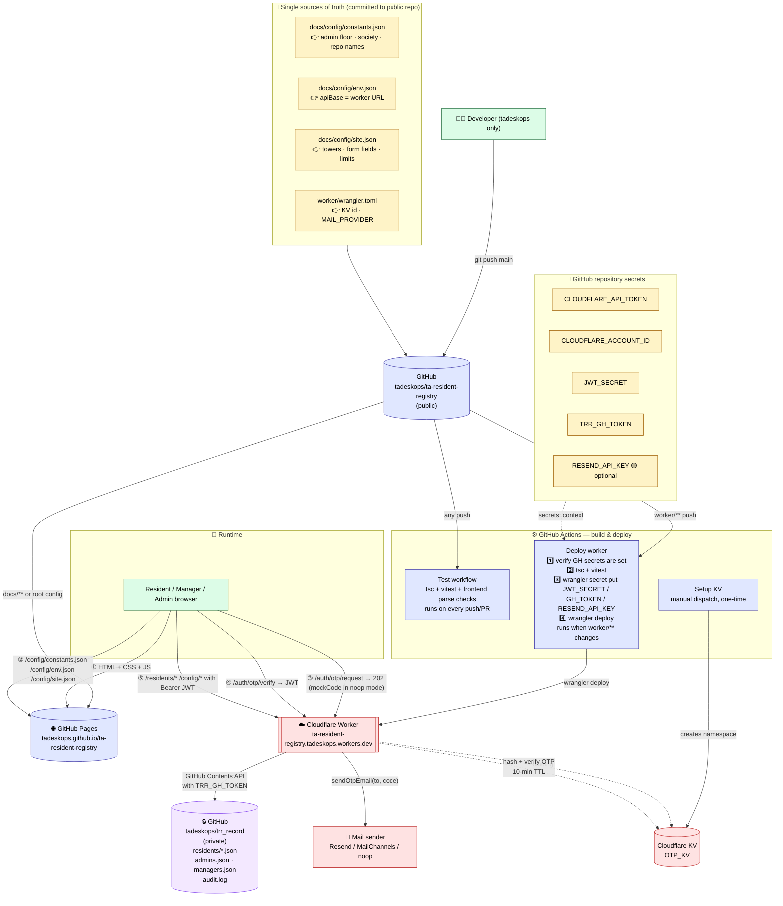

# TA Resident Registry

A dedicated resident-information portal for the Management Committee of
The Address (Tower Apartments). Residents sign in with **any** email
address (Gmail, Outlook, Yahoo, iCloud, custom domain — anything) via a
one-time code, then fill in their household details. The Resident
Registry Managers get a directory, completion tracking, and CSV export.

**Live now:**
- **Frontend:** <https://tadeskops.github.io/ta-resident-registry/>
- **Worker API:** <https://ta-resident-registry.tadeskops.workers.dev>
- **Private data repo:** [`tadeskops/trr_record`](https://github.com/tadeskops/trr_record)

## Architecture — deploy + runtime



**How to read this**

- **Yellow boxes** = files committed to the public repo — the single sources of truth
- **Blue boxes** = GitHub (public repo, Actions, Pages)
- **Red boxes** = Cloudflare (Worker + KV namespace + mail sender)
- **Purple box** = private data repo (`trr_record`)
- **Solid arrows** = actual runtime data flow
- **Dashed arrows** = build-time or configuration bindings

**Every push to `main` triggers automation.** You edit files, `git push`, and CI takes over — no local `wrangler`, no local `npm install`, no local secrets. See [DEPLOYMENT.md](DEPLOYMENT.md) for the one-time setup steps.

This repository is deliberately **separate** from
[`ta-society-helpdesk`](../ta-society-helpdesk) so resident KYC / PII
data lives on its own storage, its own repo, its own worker, and its
own access list — without leaking into the helpdesk operational tree.

Resident records themselves live in a **separate private repo**
[`tadeskops/trr_record`](https://github.com/tadeskops/trr_record).
Nothing in this public repo ever contains a resident's name, phone,
email, or DOB.

## Commit policy

**Only the `tadeskops` GitHub account may commit / push to this repo
or to `trr_record`.** See [CONTRIBUTING.md](CONTRIBUTING.md) for the
git-identity setup, the pre-commit hook, and the push-authentication
checklist. Both repos share the same policy.

> Status: **Phase 2 shipped — live** (Sep 2026). Worker deployed to
> Cloudflare, JWT-based auth working end-to-end, resident records
> persist to the private `trr_record` repo. See
> [REQUIREMENT.md §10 phasing](REQUIREMENT.md#10-phasing) for the roadmap.

## Quick preview (Windows PowerShell)

```powershell
cd ta-resident-registry\docs
python -m http.server 8792
# open http://localhost:8792/
```

Sign-in accepts any email; the "OTP" is printed to the browser console
(and pre-filled in the input) in mock mode. See
[REQUIREMENT.md §5](REQUIREMENT.md#5-authentication--email-otp) for the
real-mode contract.

## Layout

| Path | Purpose |
|---|---|
| `docs/` | Static frontend (GitHub Pages target) |
| `docs/assets/css/theme.css` | Shared visual system |
| `docs/assets/js/{auth,api,ui}.js` | Client helpers |
| `worker/` | Cloudflare Worker source (skeleton) |
| `config/` | Runtime JSON config (site, roles, residents) |
| `REQUIREMENT.md` | Product + technical spec |
| `ARCHITECTURE.md` | Deployment topology, storage layout, threat model |

## Reference material used

Design language, mobile patterns, role model, config-loader shape, and
UTF-8 file-write gotchas were all lifted from the sibling repo
[`ta-society-helpdesk`](../ta-society-helpdesk). This project is
**not** a fork — only the design system is reused. Data, auth, and
routes are independent.
